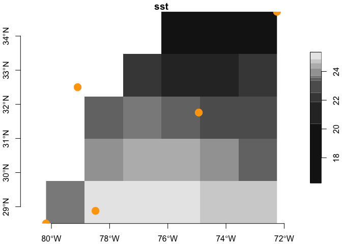

ERSST
================

# ersst

Provides for download, archiving and access to [Extended Reconstructed
Sea Surface Temperature
‘ersst’](https://www.ncei.noaa.gov/products/extended-reconstructed-sst)
online and local datasets.

### [Citation](https://www.ncei.noaa.gov/access/metadata/landing-page/bin/iso?id=gov.noaa.ncdc:C00927)

    Boyin Huang, Peter W. Thorne, Viva F. Banzon, Tim Boyer, Gennady Chepurin, Jay H. Lawrimore, Matthew J. Menne, Thomas M. Smith, Russell S. Vose, and Huai-Min Zhang (2017): NOAA Extended Reconstructed Sea Surface Temperature (ERSST), Version 5. NOAA National Centers for Environmental Information. doi:10.7289/V5T72FNM [access date, monthly from 2021-04-15].

## Requirements

From CRAN…

- [R v4+](https://www.r-project.org/)
- [rlang](https://CRAN.R-project.org/package=rlang)
- [dplyr](https://CRAN.R-project.org/package=dplyr)
- [readr](https://CRAN.R-project.org/package=readr)
- [terra](https://CRAN.R-project.org/package=terra)
- [xml2](https://CRAN.R-project.org/package=xml2)
- [httr](https://CRAN.R-project.org/package=httr)
- [rvest](https://CRAN.R-project.org/package=rvest)
- [stars](https://CRAN.R-project.org/package=stars)
- [PCICt](https://CRAN.R-project.org/package=PCICt)

## Installation

    remotes::install_github("BigelowLab/ersst")

### Usage

``` r
suppressPackageStartupMessages({
  library(dplyr)
  library(sf)
  library(ersst)
  library(stars)
})
```

#### Working with points.

We provide a small example of points from locations associated with
buoys off of the US southeast coast.

``` r
# read in example South Atlantic Bight points
x <- read_sab()

# generate a ersst url for a given date
url <- ersst_url("2018-12-18")

# download
temp_file <- tempfile(fileext = ".nc")
ok <- download.file(url, temp_file)

# open the resource
X <- ncdf4::nc_open(temp_file)

# extract the data 
covars <- ersst::extract(x, X, varname = ersst_vars(X))

# bind to the input
(y <- dplyr::bind_cols(x, covars))
```

    ## Simple feature collection with 5 features and 6 fields
    ## Geometry type: POINT
    ## Dimension:     XY
    ## Bounding box:  xmin: 279.815 ymin: 28.508 xmax: 287.752 ymax: 34.714
    ## Geodetic CRS:  WGS 84
    ## # A tibble: 5 × 7
    ##      id name     depth time                            geom   sst  ssta
    ## * <dbl> <chr>    <dbl> <dttm>                   <POINT [°]> <dbl> <dbl>
    ## 1 41009 Canveral  -1.5 2022-06-17 14:05:06 (279.815 28.508)  24.9 0.627
    ## 2 41010 Canaver…  -1.5 2022-06-29 14:05:06 (281.515 28.878)  25.3 0.717
    ## 3 41002 South H…  -1.5 2022-06-05 14:05:06 (285.064 31.759)  23.2 0.745
    ## 4 41001 East Ha…  -2   2022-04-30 14:05:06 (287.752 34.714)  22.2 0.704
    ## 5 41004 EDISTO    -1.5 2022-07-11 14:05:06 (280.901 32.502)  23.4 0.683

#### Working with bounding boxes (from points or polygons).

Learn more about working with
[stars](https://CRAN.R-project.org/package=stars) objects in the
[vignettes](https://r-spatial.github.io/stars/). Here we drop time and
depth as the ERSST data has only one depth and each file holds one time.

``` r
# derive the bounding box of the points and convert to sf coordinates
bb = sf::st_bbox(x) |>
  sf::st_as_sfc()

(covars <- ersst::extract(bb, X, varnames = ersst::ersst_vars(X)))
```

    ## stars object with 2 dimensions and 1 attribute
    ## attribute(s):
    ##          Min.  1st Qu.   Median    Mean  3rd Qu.     Max. NA's
    ## sst  16.22364 22.10888 23.58391 22.8994 24.44269 25.34757    7
    ## dimension(s):
    ##   from to offset  delta refsys x/y
    ## x    1  6  279.8  1.323 WGS 84 [x]
    ## y    1  5  34.71 -1.241 WGS 84 [y]

Now let’s see what it looks like on a quick map.

``` r
plot(covars, attr = 'sst', axes = TRUE, reset = FALSE)
plot(sf::st_geometry(x), add = TRUE, col = "orange", 
     pch = 19, cex = 2)
```

<!-- -->

``` r
# cleanup
ncdf4::nc_close(X)
```

## Local database

If you desire to build a local database of the ERSST dataset, you can
use the [update_ersst.R script](inst/scripts/update_ersst.R). First you
need to set the path for the local database using something like this.

    ersst::set_root_path("/mnt/s1/projects/ecocast/coredata/ersst")

Obviously, you would substitute in your own path. Thereafter for any R
session you can retrieve that path like this. Note that we need to
specify the version we are interested in. At the time of this
compostion, we only know about `v5` but we are totally ready for `v6`.

``` r
path = ersst_path("v5")
```

Now you can run the `update_ersst.R` script to build your database. See
the script docs for details. Once you have the database you can read it
in.

``` r
db = read_database(path) |>
  print()
```

    ## # A tibble: 4,118 × 3
    ##    date       anomaly version
    ##    <date>     <lgl>   <chr>  
    ##  1 1854-01-01 FALSE   v5     
    ##  2 1854-02-01 FALSE   v5     
    ##  3 1854-03-01 FALSE   v5     
    ##  4 1854-04-01 FALSE   v5     
    ##  5 1854-05-01 FALSE   v5     
    ##  6 1854-06-01 FALSE   v5     
    ##  7 1854-07-01 FALSE   v5     
    ##  8 1854-08-01 FALSE   v5     
    ##  9 1854-09-01 FALSE   v5     
    ## 10 1854-10-01 FALSE   v5     
    ## # ℹ 4,108 more rows

This can be filtered for a particular item (or items!)

``` r
this_db = filter(db,
                 date %in% as.Date(c("1995-12-01", "1996-01-01", "1996-02-01")))
this_db
```

    ## # A tibble: 6 × 3
    ##   date       anomaly version
    ##   <date>     <lgl>   <chr>  
    ## 1 1995-12-01 FALSE   v5     
    ## 2 1995-12-01 TRUE    v5     
    ## 3 1996-01-01 FALSE   v5     
    ## 4 1996-02-01 FALSE   v5     
    ## 5 1996-01-01 TRUE    v5     
    ## 6 1996-02-01 TRUE    v5

Now read the data.

``` r
x = read_ersst(this_db, path)
x
```

    ## stars object with 3 dimensions and 2 attributes
    ## attribute(s):
    ##                Min.    1st Qu.      Median        Mean    3rd Qu.      Max.
    ## sst       -1.800000  1.3255093 14.88280201 13.63851193 25.2284541 30.781897
    ## sst.anom  -4.763667 -0.3596543 -0.01972961 -0.06662737  0.2058811  2.317597
    ##            NA's
    ## sst       15096
    ## sst.anom  15096
    ## dimension(s):
    ##      from  to     offset   delta refsys point x/y
    ## x       1 180         -1       2 WGS 84 FALSE [x]
    ## y       1  89         89      -2 WGS 84 FALSE [y]
    ## time    1   3 1995-12-01 31 days   Date    NA
