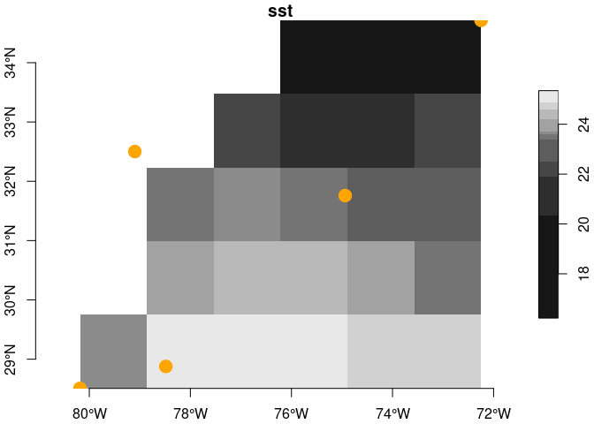

ERSST
================

# ersst

Provides for download, archiving and access to [Extended Reconstructed
Sea Surface Temperature
‘ersst’](https://www.ncdc.noaa.gov/data-access/marineocean-data/extended-reconstructed-sea-surface-temperature-ersst-v5)
online and local datasets.

### [Citation](https://www.ncei.noaa.gov/access/metadata/landing-page/bin/iso?id=gov.noaa.ncdc:C00927)

    Boyin Huang, Peter W. Thorne, Viva F. Banzon, Tim Boyer, Gennady Chepurin, Jay H. Lawrimore, Matthew J. Menne, Thomas M. Smith, Russell S. Vose, and Huai-Min Zhang (2017): NOAA Extended Reconstructed Sea Surface Temperature (ERSST), Version 5. NOAA National Centers for Environmental Information. doi:10.7289/V5T72FNM [access date, monthly from 2021-04-15].

### Requirements

From CRAN…

-   [R v4+](https://www.r-project.org/)
-   [rlang](https://CRAN.R-project.org/package=rlang)
-   [dplyr](https://CRAN.R-project.org/package=dplyr)
-   [readr](https://CRAN.R-project.org/package=readr)
-   [terra](https://CRAN.R-project.org/package=terra)
-   [xml2](https://CRAN.R-project.org/package=xml2)
-   [httr](https://CRAN.R-project.org/package=httr)
-   [rvest](https://CRAN.R-project.org/package=rvest)
-   [stars](https://CRAN.R-project.org/package=stars)
-   [PCICt](https://CRAN.R-project.org/package=PCICt)

From github…

-   [xyzt](https://CRAN.R-project.org/package=)

### Installation

    remotes::install_github("BigelowLab/ersst")

### Usage

``` r
suppressPackageStartupMessages({
  library(dplyr)
  library(sf)
  library(ersst)
  library(xyzt)
  library(stars)
})
```

#### Working with points.

See the [xyzt](https://github.com/BigelowLab/xyzt) package for more
details on the example Southern US Atlantic Bight data. These locations
are associated with buoys off of the US southeast coast.

``` r
# read in example SAB points
x <- xyzt::read_sab() |>
  dplyr::select(-time, -depth) |>
  dplyr::mutate(lon = xyzt::to_360(lon)) |>
  xyzt::as_POINT()

# generate a ersst url for a given date
url <- ersst_url("2018-12-18")

# download
temp_file <- tempfile(fileext = ".nc")
ok <- download.file(url, temp_file)

# open the resource
X <- ncdf4::nc_open(temp_file)

# extract the data 
covars <- ersst::extract(x, X, varname = ersst_vars(X))

# bind to the input
(y <- dplyr::bind_cols(x, covars))
```

    ## Simple feature collection with 5 features and 4 fields
    ## Geometry type: POINT
    ## Dimension:     XY
    ## Bounding box:  xmin: 279.815 ymin: 28.508 xmax: 287.752 ymax: 34.714
    ## Geodetic CRS:  WGS 84
    ## # A tibble: 5 × 5
    ##   id    name                   geometry   sst  ssta
    ## * <chr> <chr>               <POINT [°]> <dbl> <dbl>
    ## 1 41009 Canveral       (279.815 28.508)  24.9 0.615
    ## 2 41010 Canaveral East (281.515 28.878)  25.3 0.704
    ## 3 41002 South Hatteras (285.064 31.759)  23.2 0.745
    ## 4 41001 East Hatteras  (287.752 34.714)  22.2 0.695
    ## 5 41004 EDISTO         (280.901 32.502)  23.5 0.709

#### Working with bounding boxes (from points or polygons).

Learn more about working with
[stars](https://CRAN.R-project.org/package=stars) objects in the
[vignettes](https://r-spatial.github.io/stars/). Here we drop time and
depth as the ERSST data has only one depth and each file holds one time.

``` r
# read in example SAB points
x <- xyzt::read_sab() |>
  dplyr::select(-time, -depth) |>
  dplyr::mutate(lon = xyzt::to_360(lon)) |>
  xyzt::as_BBOX()

(covars <- ersst::extract(x, X, varnames = ersst::ersst_vars(X)))
```

    ## stars object with 2 dimensions and 2 attributes
    ## attribute(s):
    ##              Min.    1st Qu.     Median       Mean   3rd Qu.       Max. NA's
    ## sst   16.24015236 22.1057224 23.5719891 22.9032807 24.464281 25.3353024    7
    ## ssta  -0.08033943  0.5540829  0.7091904  0.6136197  0.751174  0.8032494    7
    ## dimension(s):
    ##   from to  offset   delta refsys point values x/y
    ## x    1  6 279.815 1.32283 WGS 84    NA   NULL [x]
    ## y    1  5  34.714 -1.2412 WGS 84    NA   NULL [y]

Now let’s see what it looks like on a quick map.

``` r
x <- xyzt::read_sab() |>
  dplyr::select(-time, -depth) |>
  dplyr::mutate(lon = xyzt::to_360(lon)) |>
  xyzt::as_POINT()

plot(covars, attr = 'sst', axes = TRUE, reset = FALSE)
plot(sf::st_geometry(x), add = TRUE, col = "orange", 
     pch = 19, cex = 2)
```

<!-- -->

``` r
# cleanup
ncdf4::nc_close(X)
```
