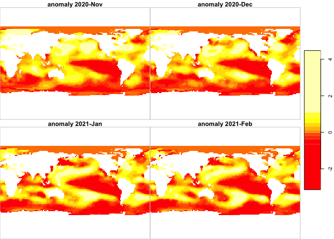

ERSST
================

# ersst

Provides for download, archiving and access to
[errst](https://www.ncdc.noaa.gov/data-access/marineocean-data/extended-reconstructed-sea-surface-temperature-ersst-v5)
online and local datasets.

### [Citation](https://www.ncei.noaa.gov/access/metadata/landing-page/bin/iso?id=gov.noaa.ncdc:C00927)

    Boyin Huang, Peter W. Thorne, Viva F. Banzon, Tim Boyer, Gennady Chepurin, Jay H. Lawrimore, Matthew J. Menne, Thomas M. Smith, Russell S. Vose, and Huai-Min Zhang (2017): NOAA Extended Reconstructed Sea Surface Temperature (ERSST), Version 5. NOAA National Centers for Environmental Information. doi:10.7289/V5T72FNM [access date, monthly from 2021-04-15].

### Requirements

  - [R v4+](https://www.r-project.org/)
  - [rlang](https://CRAN.R-project.org/package=rlang)
  - [dplyr](https://CRAN.R-project.org/package=dplyr)
  - [readr](https://CRAN.R-project.org/package=readr)
  - [terra](https://CRAN.R-project.org/package=terra)
  - [xml2](https://CRAN.R-project.org/package=xml2)
  - [httr](https://CRAN.R-project.org/package=httr)
  - [rvest](https://github.com/BigelowLab/rvest)

### Installation

    remotes::install_github("BigelowLab/ersst")

### List available file online

It is easy to generate a listing of data files, organized by month, that
are [available
online](https://www.ncei.noaa.gov/pub/data/cmb/ersst/v5/netcdf/).

``` r
library(dplyr)
library(ersst)

online_db <- ncdc_list_available(version = "v5", verbose = TRUE)
```

    ## ncdc_list_available: GETting https://www.ncei.noaa.gov/pub/data/cmb/ersst/v5/netcdf/

``` r
online_db
```

    ## # A tibble: 2,007 x 3
    ##    date       anomaly version
    ##    <date>     <lgl>   <chr>  
    ##  1 1854-01-01 FALSE   v5     
    ##  2 1854-02-01 FALSE   v5     
    ##  3 1854-03-01 FALSE   v5     
    ##  4 1854-04-01 FALSE   v5     
    ##  5 1854-05-01 FALSE   v5     
    ##  6 1854-06-01 FALSE   v5     
    ##  7 1854-07-01 FALSE   v5     
    ##  8 1854-08-01 FALSE   v5     
    ##  9 1854-09-01 FALSE   v5     
    ## 10 1854-10-01 FALSE   v5     
    ## # … with 1,997 more rows

The anomaly column indicates if the file is for `sst` or `sst anomaly` -
a bit of a red herring in this case. It will become important later, but
in the meantime know that each online file contains 2 layers: `sst` or
`sst anomaly (ssta)`. The anomaly computation is [discussed
here](https://www.ncdc.noaa.gov/data-access/marineocean-data/extended-reconstructed-sea-surface-temperature-ersst-v5).

### Download online data

For a URL by date and version, then download.

``` r
uri <- ncdc_build_uri(as.Date("1995-12-18"), version = "v5")
# [1] "https://www.ncei.noaa.gov/pub/data/cmb/ersst/v5/netcdf/ersst.v5.20199512.nc"
ok <- download_ersst(uri, path = ".", verbose = TRUE)
```

    ## download_ersst: downloading https://www.ncei.noaa.gov/pub/data/cmb/ersst/v5/netcdf/ersst.v5.199512.nc 
    ## download_ersst: to ./ersst.v5.199512.nc

``` r
ok
```

    ## ./ersst.v5.199512.nc 
    ##                 TRUE

Each file contains 2 layers: `sst` and `ssta`

``` r
library(stars)
```

    ## Loading required package: abind

    ## Loading required package: sf

    ## Linking to GEOS 3.7.2, GDAL 3.0.4, PROJ 6.3.2

``` r
s <- read_stars(names(ok))
```

    ## sst, ssta,

``` r
s
```

    ## stars object with 4 dimensions and 2 attributes
    ## attribute(s):
    ##     sst [°C]        ssta [°C]     
    ##  Min.   :-1.800   Min.   :-4.764  
    ##  1st Qu.: 1.054   1st Qu.:-0.383  
    ##  Median :14.790   Median :-0.036  
    ##  Mean   :13.511   Mean   :-0.074  
    ##  3rd Qu.:24.981   3rd Qu.: 0.210  
    ##  Max.   :30.338   Max.   : 1.591  
    ##  NA's   :5032     NA's   :5032    
    ## dimension(s):
    ##      from  to     offset delta refsys point values x/y
    ## x       1 180         -1     2     NA    NA   NULL [x]
    ## y       1  89         89    -2     NA    NA   NULL [y]
    ## lev     1   1      0 [m]    NA     NA    NA   NULL    
    ## time    1   1 1995-12-01    NA  PCICt    NA   NULL

### Download a series, unpack and save

If you are developing a local repository of the data, you can use
built-in capabilities of `fetch_ersst()`. Each layer is saved separately
as either `ersst.vv.YYYYmm.tif` or `erssta.vv.YYYYmm.tif`. Returned is a
database of the fetched-and-stored contents. Note that pass in the
available online database listing; this just saves the time needed to
repeat the query.

``` r
root_path <- "~/ersst_data"
dates <- seq(from = as.Date("2020-11-15"), by = "month", length = 4)
db <- fetch_ersst(dates, version = 'v5', path = root_path, verbose = TRUE, avail_db = online_db)
```

    ## fetch_ersst: building request list
    ## fetch_ersst: pooling databases
    ## download_ersst: downloading https://www.ncei.noaa.gov/pub/data/cmb/ersst/v5/netcdf/ersst.v5.202011.nc 
    ## download_ersst: to /tmp/RtmpWRl7pj/ersst.v5.202011.nc 
    ## fetch_ersst: writing file ~/ersst_data/v5/2020/ersst.v5.202011.tif 
    ## fetch_ersst: writing file ~/ersst_data/v5/2020/erssta.v5.202011.tif 
    ## download_ersst: downloading https://www.ncei.noaa.gov/pub/data/cmb/ersst/v5/netcdf/ersst.v5.202012.nc 
    ## download_ersst: to /tmp/RtmpWRl7pj/ersst.v5.202012.nc 
    ## fetch_ersst: writing file ~/ersst_data/v5/2020/ersst.v5.202012.tif 
    ## fetch_ersst: writing file ~/ersst_data/v5/2020/erssta.v5.202012.tif 
    ## download_ersst: downloading https://www.ncei.noaa.gov/pub/data/cmb/ersst/v5/netcdf/ersst.v5.202101.nc 
    ## download_ersst: to /tmp/RtmpWRl7pj/ersst.v5.202101.nc 
    ## fetch_ersst: writing file ~/ersst_data/v5/2021/ersst.v5.202101.tif 
    ## fetch_ersst: writing file ~/ersst_data/v5/2021/erssta.v5.202101.tif 
    ## download_ersst: downloading https://www.ncei.noaa.gov/pub/data/cmb/ersst/v5/netcdf/ersst.v5.202102.nc 
    ## download_ersst: to /tmp/RtmpWRl7pj/ersst.v5.202102.nc 
    ## fetch_ersst: writing file ~/ersst_data/v5/2021/ersst.v5.202102.tif 
    ## fetch_ersst: writing file ~/ersst_data/v5/2021/erssta.v5.202102.tif

``` r
db
```

    ## # A tibble: 8 x 3
    ##   date       anomaly version
    ##   <date>     <lgl>   <chr>  
    ## 1 2020-11-01 FALSE   v5     
    ## 2 2020-11-01 TRUE    v5     
    ## 3 2020-12-01 FALSE   v5     
    ## 4 2020-12-01 TRUE    v5     
    ## 5 2021-01-01 FALSE   v5     
    ## 6 2021-01-01 TRUE    v5     
    ## 7 2021-02-01 FALSE   v5     
    ## 8 2021-02-01 TRUE    v5

You will likely want to save this database. Note that it is best to save
it with the version. Who knows when the next version will be released,
but best practice is to be ready for it. If you have an existing
database, you can append the new database to it before saving (see
`append_database`).

``` r
v5_path <- ersst_path("v5", root = root_path)
db <- write_database(db, v5_path)
```

### Using the local database

If you have kept a database file (and if you mess your up, see
`build_database()`) then you can use it to easily find the files you
want without having to search the directories.

``` r
library(stars)
sub_db <- read_database(v5_path) %>%
  filter(anomaly == TRUE, 
         between(date, as.Date("2020-11-01"), as.Date("2021-02-01")))
sub_filenames <- compose_filename(sub_db, root_path)
ss <- read_stars(sub_filenames, along = "band")
breaks <- 11
plot(ss, 
     main = format(sub_db$date, "anonamly %Y-%b"),
     col = heat.colors(breaks))
```

<!-- -->
